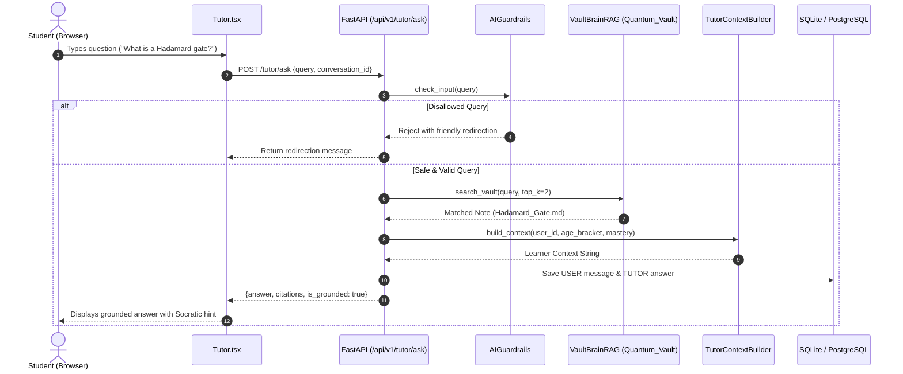

# QUBOT AI Tutor: Architecture & How It Works

## 1. Overview

The **AI Quantum Tutor** is an intelligent, personalized, and Socratic learning companion integrated into the QUBOT platform. Unlike generic LLM chatbots, the AI Tutor is **grounded directly in the platform's Obsidian Quantum Brain**, enforces strict academic **guardrails**, and **adapts its tone and depth dynamically** to the student's age group and mastery level.

```
+-------------------------------------------------------------------------------+
|                               FRONTEND (React)                                |
|  - Tutor.tsx Chat Interface                                                   |
|  - apiClient.chatWithTutor()                                                  |
+---------------------------------------+---------------------------------------+
                                        | POST /api/v1/tutor/ask
                                        v
+-------------------------------------------------------------------------------+
|                               BACKEND (FastAPI)                               |
|                                                                               |
|  1. AIGuardrails: Domain & Safety Filter                                      |
|         │                                                                     |
|  2. TutorContextBuilder: Learner Age Tier + Mastery Score                    |
|         │                                                                     |
|  3. VaultBrainRAG: Knowledge Retrieval from Quantum_Vault                     |
|         │                                                                     |
|  4. AIProvider: Socratic Response Generation & Citations                      |
|         │                                                                     |
|  5. Database Persistence: AIConversation & AIMessage Storage                  |
+---------------------------------------+---------------------------------------+
                                        |
                                        v
                      Grounded Socratic Quantum Answer
```

---

## 2. Core Pillars of the AI Tutor

### 1. Socratic Pedagogical Method
Instead of spoon-feeding direct answers to test questions, the AI Tutor encourages discovery by:
- Offering intuitive analogies first.
- Guiding the student through multi-step thought experiments.
- Asking clarifying questions to test comprehension before advancing.

### 2. Adaptive Persona (Age Tier Differentiation)
The tutor checks the student's profile (`age_bracket`) and customizes the explanation style:
- **Young Learners (Elementary / Middle School):** Uses intuitive metaphors (e.g., spinning coins, color-mixing lamps, magic coin flips) without intimidating jargon.
- **Students & Adults (High School / University / Professionals):** Employs rigorous linear algebra, Dirac bra-ket notation ($|\psi\rangle = \alpha|0\rangle + \beta|1\rangle$), unitary matrices, and Bloch sphere geometric rotations.

### 3. Grounded Retrieval (Obsidian Brain RAG)
The tutor's factual knowledge originates from curated, verified markdown notes inside the `Quantum_Vault/` directory. Each answer cites the exact vault notes and definitions used, preventing hallucinations.

### 4. Domain Guardrails
The tutor strictly avoids answering non-academic questions (e.g., celebrity gossip, politics, malware/exploits) and gently guides the student back to quantum mechanics and platform missions.

---

## 3. Detailed Component Breakdown

### A. Guardrails ([`app/ai/guardrails.py`](backend/app/ai/guardrails.py))
Before any search or generation occurs, incoming user queries pass through `AIGuardrails.check_input()`.

* **Regex Domain Matching:** Rejects disallowed patterns such as `politics`, `hack into`, `write an exploit`, and `crypto investment`.
* **Polite Redirection:** If flagged, it returns:
  > *"I am your dedicated Quantum Learning Assistant. Let's keep our focus on quantum mechanics, computing concepts, and math foundations!"*

---

### B. Knowledge Retrieval: Vault RAG ([`app/ai/vault_rag.py`](backend/app/ai/vault_rag.py))
The `VaultBrainRAG` module indexes the local `Quantum_Vault/` repository:

1. **Vault Scanning:** Parses notes with frontmatter, tags, difficulty, and structured sections (`Definition`, `Intuition`, `Mathematical Foundation`).
2. **Token Scoring:**
   - **Title Match:** +10 points per matched keyword
   - **Tag Match:** +5 points per matched tag
   - **Content Match:** +1 point per keyword occurrence
3. **Context Extraction:** Returns the top $K$ most relevant concept notes with summaries, formulas, and section extracts.

---

### C. Context Assembly ([`app/ai/tutor_context.py`](backend/app/ai/tutor_context.py))
`TutorContextBuilder` prepares a sanitized, privacy-safe learner summary:

```text
LEARNER PROFILE:
- Age Tier: STUDENT
- Current Concept: Quantum Superposition
- Concept Mastery: 75%
- Recent Struggled Question / Misconception: Phase flip vs Bit flip
```

---

### D. Generation & Response Formatting ([`app/ai/provider.py`](backend/app/ai/provider.py))
`AIProvider.generate_tutor_response()` synthesizes:
1. Grounded excerpt from the retrieved vault note (`title`, `folder`, `summary`, `intuition`, `key formula`).
2. A Socratic follow-up question (e.g., *"How do you think this property affects measurement in a multi-qubit circuit?"*).
3. Verified citation slugs for UI display.

---

### E. Conversation History & Persistence ([`app/services/ai_tutor_service.py`](backend/app/services/ai_tutor_service.py))
The service logs interactions in the database:
- **`AIConversation` table:** Stores user sessions, conversation titles, and timestamps.
- **`AIMessage` table:** Stores message history (`USER` query vs. `TUTOR` response) with associated citations.

---

## 4. Frontend Integration

* **Page:** [`frontend/src/pages/Tutor.tsx`](frontend/src/pages/Tutor.tsx)
* **Client Service:** [`frontend/src/services/apiClient.ts`](frontend/src/services/apiClient.ts)

### How It Renders in the UI:
1. **Interactive Chat:** Message bubbles distinguish student queries from the AI Tutor's responses.
2. **Offline Resilience:** If the backend service is offline, the frontend falls back onto a local heuristic quantum assistant without crashing.
3. **Context Badges:** Highlights current active topics like **Superposition**, **Entanglement**, and **Bloch Sphere Coordinates**.

---

## 5. Summary Flow Diagram


