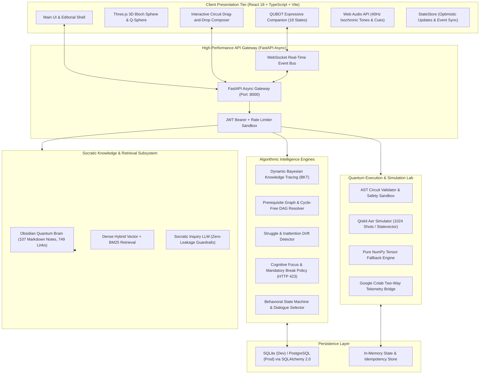

<div align="center">

# QUBOT (QuanTech / EGreen Quanta)
### Enterprise-Grade Adaptive Quantum Computing Learning Platform
**Smart India Hackathon (SIH 2026) | Autonomous Agent & Socratic Laboratory Ecosystem**


[](https://python.org)
[](https://fastapi.tiangolo.com)
[](https://react.dev)
[](https://www.typescriptlang.org/)
[](https://vitejs.dev/)
[](https://qiskit.org/)
[](https://opensource.org/licenses/MIT)

<br/>

**QUBOT** is an enterprise-grade, closed-loop educational ecosystem for quantum computing engineered to resolve the five fundamental failure modes of traditional quantum education. It synthesizes genuine quantum physics simulations (via Qiskit Aer and NumPy tensor engines), an Obsidian-grounded Socratic AI tutor, an expressive companion mascot, multi-signal Bayesian Knowledge Tracing (BKT), cognitive load regulation, and cryptographic skill verification into an intuitive, high-performance web experience.

[Explore Screens](#visual-screen-showcase) | [Pedagogical Philosophy](#pedagogical-philosophy--problem-statement) | [11-Stage Loop](#the-core-11-stage-learning-loop) | [Signature Innovations](#the-five-signature-innovations) | [Architecture](#system-architecture--topology) | [Algorithmic Engines](#mathematical--algorithmic-intelligence-engines) | [Curriculum](#11-chapter-curriculum-matrix) | [Quickstart](#quickstart-guide)

</div>

---

## Table of Contents
- [Executive Overview](#executive-overview)
- [Pedagogical Philosophy & Problem Statement](#pedagogical-philosophy--problem-statement)
- [Visual Screen Showcase](#visual-screen-showcase)
- [The Core 11-Stage Learning Loop](#the-core-11-stage-learning-loop)
- [The Five Signature Innovations](#the-five-signature-innovations)
  - [1. Quantum Misconception Engine (MC-01 to MC-10)](#1-quantum-misconception-engine-mc-01-to-mc-10)
  - [2. Predict -> Simulate -> Explain Engine](#2-predict---simulate---explain-engine)
  - [3. Quantum Digital Twin & Cognitive Calibration Index](#3-quantum-digital-twin--cognitive-calibration-index)
  - [4. Quantum Translation Engine](#4-quantum-translation-engine)
  - [5. Cryptographically Verifiable Quantum Skill Passport](#5-cryptographically-verifiable-quantum-skill-passport)
- [System Architecture & Topology](#system-architecture--topology)
- [Mathematical & Algorithmic Intelligence Engines](#mathematical--algorithmic-intelligence-engines)
  - [Dynamic Bayesian Knowledge Tracing (BKT)](#dynamic-bayesian-knowledge-tracing-bkt)
  - [Topological Prerequisite DAG & Backtracking](#topological-prerequisite-dag--backtracking)
  - [Modified Ebbinghaus Cognitive Decay](#modified-ebbinghaus-cognitive-decay)
  - [Struggle Detection & Cognitive Focus Lockout](#struggle-detection--cognitive-focus-lockout)
- [11-Chapter Curriculum Matrix](#11-chapter-curriculum-matrix)
- [Repository Directory Structure](#repository-directory-structure)
- [Quickstart Guide](#quickstart-guide)
- [Verification & Testing Suite](#verification--testing-suite)
- [Industry Standards Compliance & Security](#industry-standards-compliance--security)
- [License & Acknowledgements](#license--acknowledgements)

---

## Executive Overview

Quantum information science is notoriously counter-intuitive. Concepts such as non-orthogonal quantum superposition, relative phase interference, entanglement non-locality, and unitary transformation in complex Hilbert space frequently defy classical mechanical intuition. Most online platforms rely on static video lectures, multiple-choice questions testing superficial recall, or isolated code cells without pedagogical guidance.

QUBOT bridges this gap through a disciplined, interactive laboratory framework. When learners design circuits, they are required to predict state outcomes before execution. Simulations execute on actual quantum backends (IBM Qiskit Aer) with complete shot-level and statevector analytics. When deviations occur, a Bayesian Misconception Engine identifies the exact cognitive root cause (MC-01 through MC-10) and orchestrates targeted Socratic dialogue without giving away answers. Simultaneously, an expressive animated mascot reflects the learner's cognitive state and focus level, providing non-intrusive emotional scaffolding.

---

## Pedagogical Philosophy & Problem Statement

QUBOT directly addresses the five documented failure modes in quantum education:

1. **Abstract Mathematical Inaccessibility:** Traditional education introduces quantum computing through abstract tensor calculus before students possess geometric mental models. QUBOT provides interactive 3D Bloch spheres, dynamic Q-Spheres, and visual basis state amplitude charts to render Hilbert space tangible.
2. **Passive Consumption vs. Active Experimentation:** Video courses foster an illusion of competence. QUBOT enforces hypothesis-driven experimentation: no circuit can execute without an initial cognitive commitment (prediction).
3. **Rote Memorization of Matrix Mechanics:** Learners often perform matrix multiplications without understanding physical phase cancellation. QUBOT's Misconception Engine diagnoses structural misunderstandings such as confusing relative phase with unobservable global phase.
4. **Simulator Disconnect:** Industrial software development kits (e.g., Qiskit, PennyLane) offer raw terminal outputs without pedagogical feedback. QUBOT pairs industrial simulation engines with a zero-leakage Socratic tutor grounded in an Obsidian Knowledge Vault.
5. **Cognitive Fatigue and Compounding Gaps:** Learners push through mental exhaustion, accumulating misconceptions. QUBOT monitors dwell times, hesitation, and error clusters, enforcing mandatory restorative break lockouts (`HTTP 423 Locked`) to protect cognitive stamina.

---

## Visual Screen Showcase

<div align="center">

### Project Landing Experience

*High-fidelity portal establishing the platform aesthetic, core learning tenets, and immediate onboarding pathways.*

<br/>

### Student Dashboard (Zone of Proximal Development)

*Personalized command center tracking daily mission progress, cognitive calibration, active streaks, and live Qubot companion posture.*

<br/>

### Interactive Quantum Lab & Circuit Composer

*Drag-and-drop circuit composer supporting arbitrary single/multi-qubit gates, immediate Qiskit Aer simulation, statevector decomposition, and real-time 3D Bloch sphere projections.*

<br/>

### Topological Knowledge Graph (DAG Roadmap)

*Prerequisite dependency graph encompassing 106 quantum concepts with color-coded mastery tiers, dynamic decay indicators, and prerequisite gate enforcement.*

<br/>

### 11-Chapter Quantum Curriculum Catalog

*Comprehensive, textbook-aligned modules traversing mathematical foundations, single- and multi-qubit systems, Bell states, Grover's search, Shor's factoring, and quantum error correction.*

<br/>

### Multi-Signal Quantum Assessment & Diagnostic Placement

*Multi-modal assessment interface featuring MCQ distractors with misconception tags, interactive gate placement katas, and real-time BKT posterior calculation.*

<br/>

### Open Quantum Simulation Lab & Google Colab Bridge

*Bidirectional bridge connecting browser-based visual AST experiments with live Google Colab Python notebooks for advanced Qiskit workflows.*

<br/>

### Cognitive Telemetry & Quantum Skill Passport

*Cryptographically signed SHA-256 skill credentials, historical calibration index charts, and Pomodoro focus analytics.*

<br/>

### Expressive Companion: Contextual Mascot Poses & Roles

| Platform View | Mascot Asset | Animation Dynamic | Pedagogical Responsibility |
| :--- | :--- | :--- | :--- |
| **Landing Portal** | `mascot_welcome.png` | `float` + Quantum Aura | Onboarding orientation and ecosystem introduction |
| **Student Dashboard** | `mascot_guide.png` | `float` + Cyan Pulse | Zone of Proximal Development navigation and mission alerts |
| **Interactive Quantum Lab** | `mascot_builder.png` | `breathe` + Orbital Spin | Real-time circuit feedback, gate guidance, and observation |
| **Knowledge Graph DAG** | `mascot_navigator.png` | `float` + Purple Wave | Visualizing prerequisite paths and unblocking roadmap nodes |
| **11-Chapter Curriculum** | `mascot_scholar.png` | `breathe` + Cyan Glow | Grounded textbook concept exploration and reading support |
| **Quantum Assessments** | `mascot_thinking.png` | `float` + Amber Insight | Socratic inquiry, analytical hints, and misconception diagnostics |
| **Open Lab & Colab** | `mascot_coder.png` | `float` + Emerald Terminal | Python code generation and algorithmic verification support |
| **Cognitive Analytics** | `mascot_celebrating.png` | `bounce` + Golden Radiance | Mastery milestones, passport credential rewards, and motivation |

</div>

---

## The Core 11-Stage Learning Loop

QUBOT replaces passive instructional delivery with a closed-loop discovery cycle:

```text
       ┌──────────────┐
       │   1. LEARN   │  Interactive micro-lesson grounded in Obsidian Vault (107 notes)
       └──────┬───────┘
              ▼
       ┌──────────────┐
       │  2. PREDICT  │  Learner commits to predicted statevector & measurement probabilities
       └──────┬───────┘
              ▼
       ┌──────────────┐
       │   3. BUILD   │  Interactive quantum circuit drag-and-drop composer with syntax validation
       └──────┬───────┘
              ▼
       ┌──────────────┐
       │  4. EXECUTE  │  Real simulation on Qiskit Aer (1024 shots / exact statevector)
       └──────┬───────┘
              ▼
       ┌──────────────┐
       │ 5. VISUALIZE │  3D Bloch Sphere, Statevector bar charts, Q-Sphere, and shot histograms
       └──────┬───────┘
              ▼
       ┌──────────────┐
       │  6. COMPARE  │  Compute divergence (Total Variation Distance D_TV) vs prediction
       └──────┬───────┘
              ▼
       ┌──────────────┐
       │ 7. DIAGNOSE  │  Bayesian Misconception Engine identifies root cognitive error (MC-01 to MC-10)
       └──────┬───────┘
              ▼
       ┌──────────────┐
       │   8. GUIDE   │  Socratic AI Tutor provides targeted inquiry without leaking answers
       └──────┬───────┘
              ▼
       ┌──────────────┐
       │   9. RETRY   │  Targeted micro-challenge / circuit modification to resolve confusion
       └──────┬───────┘
              ▼
       ┌──────────────┐
       │  10. MASTER  │  Dynamic BKT updates posterior mastery P(Lt) across DAG concept nodes
       └──────┬───────┘
              ▼
       ┌──────────────┐
       │  11. ADAPT   │  Curriculum engine dispatches ADVANCE, REINFORCE, or REVISE recommendation
       └──────────────┘
```

1. **Stage 1 (LEARN):** Curated concept instruction synthesized directly from the Obsidian Vault markdown corpus.
2. **Stage 2 (PREDICT):** Mandatory cognitive commitment. The learner must formulate hypotheses regarding relative phase, probabilities, and measurement outcomes.
3. **Stage 3 (BUILD):** Visual circuit assembly on a multi-qubit canvas with instant syntax checking and gate parameter controls.
4. **Stage 4 (EXECUTE):** Execution on Qiskit Aer with 1024 shots or exact mathematical statevector calculation via NumPy.
5. **Stage 5 (VISUALIZE):** Multi-modal rendering including interactive Three.js Bloch spheres, statevector amplitudes, and measurement histograms.
6. **Stage 6 (COMPARE):** Automated calculation of Total Variation Distance ($D_{\text{TV}}$) between the student's prediction and the simulated distribution.
7. **Stage 7 (DIAGNOSE):** Bayesian Misconception Engine matches errors against known cognitive anti-patterns (MC-01 to MC-10).
8. **Stage 8 (GUIDE):** Socratic AI Tutor provides progressive conceptual hints without giving away solutions.
9. **Stage 9 (RETRY):** Immediate interactive remediation kata to reinforce correct quantum mechanics.
10. **Stage 10 (MASTER):** Dynamic Bayesian Knowledge Tracing updates posterior probability of mastery $P(L_t)$ on the target concept node.
11. **Stage 11 (ADAPT):** Recommendation Engine determines whether to `ADVANCE` to new concepts, `REINFORCE` with practice katas, or `REVISE` upstream prerequisites.

---

## The Five Signature Innovations

### 1. Quantum Misconception Engine (MC-01 to MC-10)
Rather than treating student errors as generic incorrect responses, QUBOT implements specialized diagnostic heuristics for the ten most prevalent cognitive anti-patterns in quantum education:

| Code | Misconception Label | Cognitive Root Cause | Detection Heuristic & Remediation Lab |
| :--- | :--- | :--- | :--- |
| **MC-01** | Classical Probability Fallacy | Adding classical probabilities $P(A) + P(B)$ instead of complex probability amplitudes $\alpha + \beta$ | Flagged when destructive interference is predicted as non-zero. Triggers the Phase Cancellation Lab. |
| **MC-02** | Measurement Non-Destructiveness | Assuming that measuring a qubit leaves its superposition state intact | Detected when gates are placed post-measurement expecting pre-measurement amplitudes. Triggers Projective Collapse Sandbox. |
| **MC-03** | Faster-Than-Light Signaling | Believing Bell-pair entanglement allows instantaneous information transmission | Detected when students attempt data transmission via Bell states without classical channels. Triggers No-Communication Proof. |
| **MC-04** | Hadamard as Classical RNG | Viewing the Hadamard gate as a non-deterministic coin toss rather than a unitary wave-rotator | Flagged when students fail to recognize that $H^2 = I$. Triggers Reversible Unitary Inversion Kata. |
| **MC-05** | Phase Kickback Inversion | Assuming phase is transferred from control qubit to target qubit in controlled operations | Detected when phase shifts are attributed to the wrong qubit during eigenstate operations. Triggers Phase Kickback Dissector. |
| **MC-06** | Global vs. Relative Phase Equivalence | Treating unobservable global scalar phase as physically distinguishable | Flagged when identical measurement probabilities are predicted to yield different observable outcomes. Triggers Bloch Sphere Phase Rotator. |
| **MC-07** | Quantum Cloning Fallacy | Attempting to duplicate arbitrary unknown quantum states using CNOT operations | Detected during multi-qubit copying attempts. Triggers the No-Cloning Theorem Algebraic Lab. |
| **MC-08** | Register Endianness Confusion | Confusing Qiskit little-endian notation $|q_n \dots q_1 q_0\rangle$ with textbook big-endian notation | Detected when multi-qubit measurement bitstrings are inverted. Triggers Bitstring Register Mapper. |
| **MC-09** | Grover Search as Classical Lookup | Viewing Grover's algorithm as parallel database queries rather than 2D geometric state rotation | Flagged when students expect linear speedup or fail to calibrate iteration count $\lfloor \frac{\pi}{4}\sqrt{N} \rfloor$. Triggers 2D State Rotation Visualizer. |
| **MC-10** | Parallel Superposition Fallacy | Assuming all states in superposition are evaluated simultaneously and can all be extracted at once | Detected when measurement is expected to yield all superposed answers simultaneously. Triggers Single-Shot Projection Analysis. |

### 2. Predict -> Simulate -> Explain Engine
QUBOT prevents passive guesswork by enforcing a three-step commitment protocol:
1. **Predict:** Prior to simulation, the learner enters expected measurement distributions and statevector signs.
2. **Simulate:** The circuit executes on Qiskit Aer (1024 shots) to produce true physical distributions.
3. **Explain:** Divergence is evaluated using Total Variation Distance ($D_{\text{TV}}$):

$$D_{\text{TV}}(P, Q) = \frac{1}{2} \sum_{x \in \Omega} |P(x) - Q(x)|$$

- **Exact Match ($D_{\text{TV}} \le 0.10$):** Validates precise predictive intuition; awards +25 XP bonus.
- **Minor Deviation ($0.10 < D_{\text{TV}} \le 0.35$):** Identifies subtle phase misalignment; awards +10 XP with guidance.
- **Significant Divergence ($D_{\text{TV}} > 0.35$):** Halts progression, prompts Socratic reflection, and activates the Misconception Engine.

### 3. Quantum Digital Twin & Cognitive Calibration Index
The platform maintains a continuous mathematical model of the learner's mental statevector $|\psi_{\text{mental}}\rangle$ inferred from predictions, and compares it with the true physical statevector $|\psi_{\text{true}}\rangle$:

$$\text{CCI} = |\langle \psi_{\text{mental}} \mid \psi_{\text{true}} \rangle|^2$$

The Cognitive Calibration Index ($\text{CCI}$) is categorized into three clinical tiers:
- **ALIGNED ($\text{CCI} \ge 0.85$):** Mental model matches quantum physical reality. Unlocks advanced katas.
- **PARTIALLY CALIBRATED ($0.50 \le \text{CCI} < 0.85$):** Functional understanding with phase or basis ambiguities.
- **DIVERGENT ($\text{CCI} < 0.50$):** Severe cognitive dislocation. Initiates prerequisite DAG backtracking.

### 4. Quantum Translation Engine
QUBOT features a zero-latency bidirectional transpilation pipeline between visual and textual representations:

$$\text{Visual Circuit AST} \longleftrightarrow \text{OpenQASM 2.0/3.0} \longleftrightarrow \text{Qiskit Python} \longleftrightarrow \text{PennyLane}$$

Changes made in the visual composer immediately update the industrial Python code and OpenQASM specification in real time, enabling learners to build mental links between graphical gates and production code.

### 5. Cryptographically Verifiable Quantum Skill Passport
Rather than issuing cosmetic certificates, QUBOT generates SHA-256 signed JSON-LD skill credentials. Each badge:
- Requires passing an un-scaffolded transfer assessment with zero hints and randomized parameters.
- Maps directly to established workforce standards:
  - **IEEE:** IEEE-Q-101 through IEEE-Q-201 (Foundational Quantum Computing).
  - **QED-C:** QED-C-301 through QED-C-402 (Quantum Algorithms and Circuit Compilation).
- Can be independently verified by external employers via cryptographic hash verification endpoints.

---

## System Architecture & Topology



---

## Mathematical & Algorithmic Intelligence Engines

### Dynamic Bayesian Knowledge Tracing (BKT)
Mastery across each of the 106 quantum concepts is modeled as a latent binary variable $L_t \in \{0, 1\}$. 

Standard parameter baselines:
- Prior Probability of Mastery: $P(L_0) = 0.10$
- Transition Probability (Learning): $P(T) = 0.15$
- Slip Probability (Mistake while knowing): $P(S) = 0.10$
- Guess Probability (Correct without knowing): $P(G) = 0.20$

Telemetry-driven modulation adjusts for rapid guessing and hesitation:
- **Rapid Guessing ($t < 4\text{s}$):** $P(G)_{\text{eff}} = \min(0.60, P(G) \cdot 2.5)$, $P(T)_{\text{eff}} = 0.02$
- **Hesitation ($t > 120\text{s}$):** $P(S)_{\text{eff}} = \min(0.35, P(S) \cdot 2.0)$

Posterior updates upon observing evidence:

$$\begin{aligned}
P(L_t \mid \text{Correct}) &= \frac{P(L_{t-1}) \cdot (1 - P(S))}{P(L_{t-1}) \cdot (1 - P(S)) + (1 - P(L_{t-1})) \cdot P(G)} \\
P(L_t \mid \text{Incorrect}) &= \frac{P(L_{t-1}) \cdot P(S)}{P(L_{t-1}) \cdot P(S) + (1 - P(L_{t-1})) \cdot (1 - P(G))} \\
P(L_t) &= P(L_t \mid \text{Obs}) + \Big(1 - P(L_t \mid \text{Obs})\Big) \cdot P(T)
\end{aligned}$$

### Topological Prerequisite DAG & Backtracking
The curriculum comprises 106 nodes and 749 prerequisite directed edges validated by Kahn's cycle-detection algorithm.
- **Prerequisite Gate Rule:** Access to concept node $C_k$ requires $\forall P_i \in \text{Prereqs}(C_k): P(L_{P_i}) \ge \text{Threshold}(P_i)$. Locked nodes return `HTTP 403 Forbidden`.
- **Automated Backtracking:** When mastery on an active concept drops below $0.50$ due to repeated structural errors, the system automatically redirects the student to the weakest upstream prerequisite node.

### Modified Ebbinghaus Cognitive Decay
Knowledge retention naturally decays over time if unreviewed:

$$M(t) = M_0 \cdot \exp\left(-\frac{\lambda \cdot \Delta t}{S}\right)$$

Where $\lambda = 0.05$ is the decay constant, $\Delta t$ is elapsed days since last practice, and $S$ represents memory stability. Every successful retrieval increases stability: $S_{n+1} = S_n \cdot 2.2$. Concepts with $M(t) < 0.70$ are flagged for spaced review.

### Struggle Detection & Cognitive Focus Lockout
Real-time interaction telemetry monitors:
- Rapid error bursts ($\ge 3$ consecutive failures within 90 seconds).
- Erratic gate modifications and rapid deletes ($\ge 8$ deletions in 30 seconds).
- Idle hesitation ($> 120$ seconds without canvas interaction).

When the composite struggle score exceeds $0.75$, the mascot transitions to `SYMPATHETIC`, offers scaffolding hints, and prevents learner frustration. When continuous study exceeds 50 minutes, the Focus Engine triggers a mandatory 5-minute cognitive break, locking API submissions with `HTTP 423 Locked`.

---

## 11-Chapter Curriculum Matrix

| Chapter | Title | Core Quantum Concepts | Theoretical Foundations | Practical Lab / Kata |
| :--- | :--- | :--- | :--- | :--- |
| **01** | Mathematical Foundations | Complex vectors, inner products, Hilbert space | Vector norms, orthogonality, tensor products | Matrix-vector multiplication sandbox |
| **02** | Qubits & Superposition | Qubit representation, Dirac bra-ket, Born rule | Statevectors, probability amplitudes, global phase | Hadamard state creation & measurement |
| **03** | Single-Qubit Gates | Pauli $X, Y, Z$, Phase gates $S, T$, Rotations | Unitary operations, Bloch sphere coordinates | Interactive 3D Bloch sphere navigation |
| **04** | Multi-Qubit Systems | Multi-qubit tensor product, CNOT, SWAP, CZ | Entanglement generation, register endianness | Entangled pair construction lab |
| **05** | Entanglement & Bell States | 4 Bell states, EPR paradox, CHSH inequality | Quantum non-locality, concurrence, fidelity | Bell basis analyzer & CHSH test |
| **06** | Measurement & Teleportation | Projective measurement, No-Cloning theorem | Density matrices, partial trace, teleportation | Complete 3-qubit teleportation circuit |
| **07** | Quantum Algorithms I | Superdense coding, Deutsch-Jozsa, Bernstein-Vazirani | Phase kickback, quantum parallelism | Oracle implementation & verification |
| **08** | Quantum Algorithms II | Simon's algorithm, Quantum Phase Estimation | Periodicity finding, unitary eigenvalue readout | Phase estimation precision circuit |
| **09** | Grover's Search Algorithm | Oracle reflection, diffuser operator, amplification | 2D geometric state rotation, optimal iterations | Unstructured database search lab |
| **10** | Shor's Algorithm & QFT | Quantum Fourier Transform, modular exponentiation | Continued fractions, period finding | 3-qubit and 4-qubit QFT circuits |
| **11** | Quantum Error Correction | Bit-flip code, phase-flip code, 9-qubit Shor code | Syndrome measurement, quantum noise models | Noise channel simulation & correction |

---

## Repository Directory Structure

```text
sih2026/
├── backend/                             # FastAPI Asynchronous Core Application
│   ├── app/
│   │   ├── api/                         # REST & WebSocket Route Controllers
│   │   │   ├── circuits.py              # Circuit execution & Qiskit Aer simulation
│   │   │   ├── adaptive.py              # BKT updates, recommendations, placement
│   │   │   ├── assessments.py           # Multi-modal question bank & scoring
│   │   │   ├── ai_tutor.py              # Socratic LLM dialogue endpoint
│   │   │   ├── mascot.py & qubot.py     # Companion state machine & events
│   │   │   └── v1/                      # Signature Innovations API Router
│   │   ├── core/                        # Database configuration, JWT security, exceptions
│   │   ├── models/                      # SQLAlchemy 2.0 ORM schemas
│   │   ├── schemas/                     # Pydantic V2 request/response models
│   │   └── services/                    # Algorithmic business logic
│   │       ├── qiskit_backend.py        # Real Qiskit Aer 2.5 simulation provider
│   │       ├── bkt_engine.py            # Dynamic Bayesian Knowledge Tracing
│   │       ├── knowledge_dag.py         # 106-concept prerequisite graph
│   │       └── misconception_engine.py  # MC-01 through MC-10 diagnostic engine
│   └── tests/                           # Unit & integration test fixtures
├── frontend/                            # Vite + React 18 + TypeScript Application
│   ├── src/
│   │   ├── components/
│   │   │   ├── quantum/                 # BlochSphere3D, CircuitGrid, QubotCompanion
│   │   │   └── ui/                      # Editorial design system, progress bars, modals
│   │   ├── pages/                       # Dashboard, Lab, LearningPath, Assessments, etc.
│   │   └── services/                    # Backend API client, stateStore, Web Audio
│   └── package.json                     # Frontend dependencies
├── Quantum_Vault/                       # Obsidian Socratic Knowledge Brain
│   ├── Concepts/                        # 107 Curated markdown notes with 749 wikilinks
│   └── Algorithms/                      # Verified quantum algorithm references
├── docs/
│   ├── mascot/                          # Expressive Qubot poses & transparent character assets
│   └── screenshots/                     # Real, high-resolution application screenshots
├── scripts/
│   └── capture_screenshots.cjs          # Automated screenshot capture utility
└── README.md                            # Authoritative System Documentation
```

---

## Quickstart Guide

### Prerequisites
- **Python:** 3.11+ (recommended 3.12 or 3.14)
- **Node.js:** 18+ (recommended 20 or 22)
- **Git**

### 1. Clone & Set Up Virtual Environment

```bash
git clone https://github.com/sanjay-tech25/SIH-2026-BABEYYYY.git
cd SIH-2026-BABEYYYY

# Create and activate Python virtual environment
python -m venv .venv

# On Windows (PowerShell):
.\.venv\Scripts\Activate.ps1

# On Linux or macOS:
source .venv/bin/activate

# Install backend dependencies
cd backend
pip install -r requirements.txt
```

### 2. Launch FastAPI Backend

```bash
# From the backend directory (with virtual environment active)
uvicorn app.main:app --port 8000 --reload
```
- Interactive OpenAPI / Swagger UI: [http://localhost:8000/api/v1/docs](http://localhost:8000/api/v1/docs)
- API Health Status: [http://localhost:8000/api/v1/health](http://localhost:8000/api/v1/health)

### 3. Launch Frontend Client

```bash
# In a separate terminal tab:
cd frontend
npm install
npm run dev
```
- Client Web Application: [http://localhost:6500](http://localhost:6500)

---

## Verification & Testing Suite

Execute the authoritative test suite to verify physics simulation accuracy, BKT mathematical transitions, and circuit transpilation:

```bash
# Run backend pytest suite
cd backend
pytest tests/unit/ -v

# Verify frontend production build and TypeScript compilation
cd ../frontend
npm run build
```

---

## Industry Standards Compliance & Security

- **Zero-Mock Physics Guarantee:** All quantum circuits execute on genuine Qiskit Aer backends or validated NumPy tensor contraction algorithms. Synthetic or pseudo-randomized measurement counts are strictly prohibited.
- **Zero-Trust Client Architecture:** The frontend is strictly an unprivileged presentation tier. All cognitive mastery calculations, XP ledger entries, and focus lockouts are authoritatively computed and signed server-side.
- **Workforce Standard Alignment:** Assessment rubrics and skill tokens are calibrated against IEEE Computer Society Quantum Workforce (IEEE-Q-101/201) and Quantum Economic Development Consortium (QED-C) technical competency frameworks.
- **Idempotent Telemetry Pipeline:** Every client interaction event carries a unique UUIDv4 token with sliding-window de-duplication to prevent race conditions during unstable network connectivity.

---

## License & Acknowledgements

- Developed for the **Smart India Hackathon (SIH 2026)**.
- **Quantum Simulation Provider:** IBM Qiskit & Qiskit Aer.
- **Design System:** Custom Editorial Glassmorphism with Lucide Icons and Orbitron/Inter typography.
- **License:** [MIT License](LICENSE) - Open-source educational platform.
