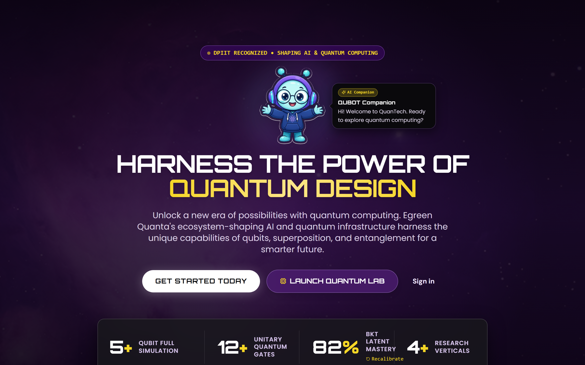
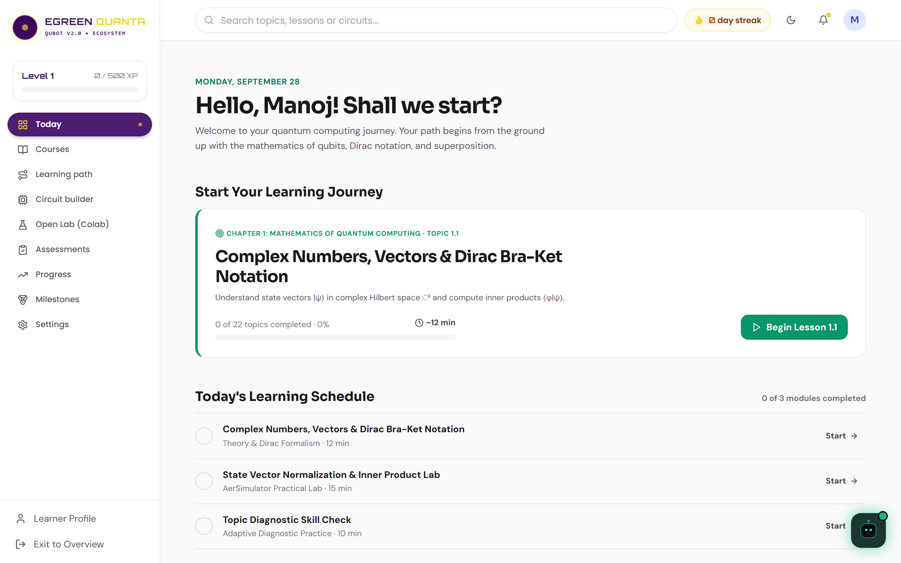
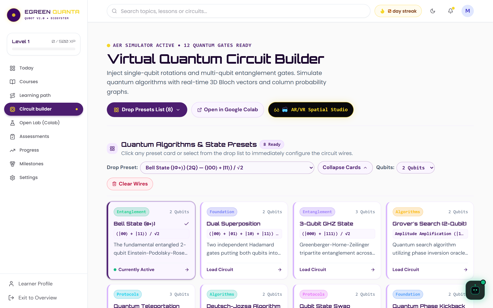
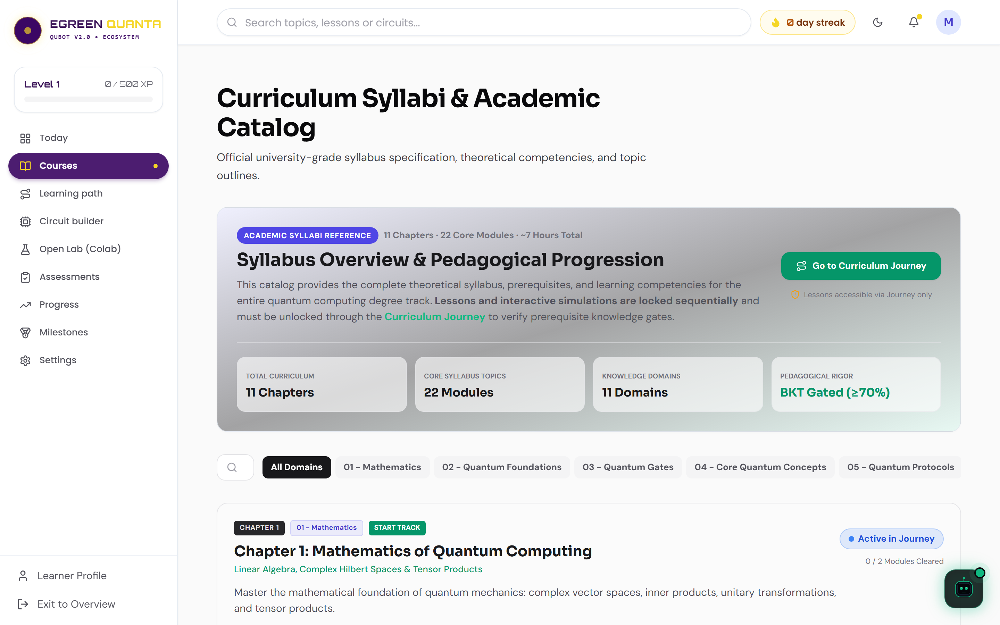
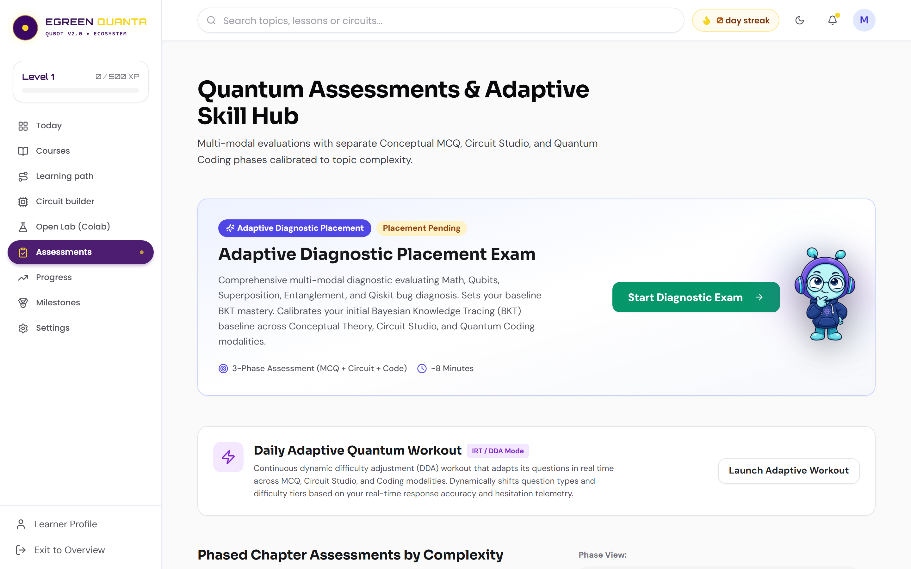
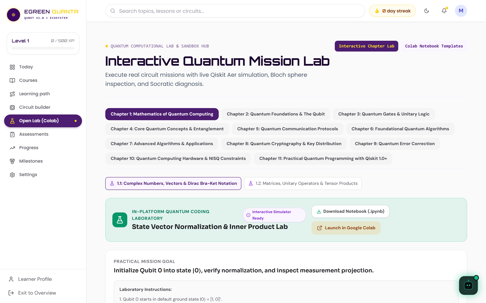
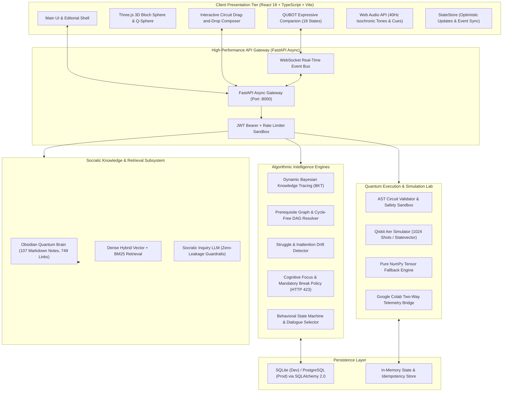

<div align="center">

# ⚛️ QUBOT (QuanTech / EGreen Quanta)
### AI-Powered Adaptive Quantum Computing Learning Platform
**Smart India Hackathon (SIH 2026) | Autonomous Agent & Socratic Laboratory Ecosystem**


[](https://python.org)
[](https://fastapi.tiangolo.com)
[](https://react.dev)
[](https://www.typescriptlang.org/)
[](https://vitejs.dev/)
[](https://qiskit.org/)
[](https://opensource.org/licenses/MIT)

<br/>

**QUBOT** is an enterprise-grade, closed-loop educational ecosystem for quantum computing that solves the five fundamental failure modes of traditional quantum education. It unifies genuine quantum physics simulations (Qiskit Aer & NumPy), an Obsidian-grounded Socratic AI tutor, an expressive companion mascot, multi-signal Bayesian mastery modeling, and cognitive load regulation into an intuitive, gamified web experience.

[Explore Screens](#-visual-screen-showcase) • [11-Stage Loop](#-the-core-11-stage-learning-loop) • [Signature Innovations](#-the-five-signature-innovations) • [Architecture](#-system-architecture--topology) • [Quickstart](#-quickstart-guide) • [Curriculum](#-11-chapter-curriculum-matrix)

</div>

---

## 📸 Visual Screen Showcase

<div align="center">

### 🌟 Project Landing Experience

*Futuristic entry portal welcoming learners into the quantum computing ecosystem.*

<br/>

### 🧭 Student Dashboard (Zone of Proximal Development)

*Personalized learning dashboard featuring dynamic daily missions, continuous cognitive metrics, and the real-time Qubot companion.*

<br/>

### ⚛️ Interactive Quantum Lab & Circuit Composer

*Drag-and-drop circuit composer with instant Qiskit Aer simulation, statevector breakdown, and real-time 3D Bloch Sphere projection.*

<br/>

### 🧬 Topological Knowledge Graph (DAG Roadmap)

*Interactive 106-concept DAG visualizing prerequisite dependencies, mastery percentages, and dynamic cognitive decay.*

<br/>

### 📚 11-Chapter Quantum Curriculum Catalog

*Structured progression from linear algebra foundations to Grover's algorithm, Shor's algorithm, and quantum error correction.*

<br/>

### 🎯 Multi-Signal Quantum Assessment & Diagnostic Placement

*Diagnostic evaluations with automated Bayesian Knowledge Tracing updates and instant Socratic misconception diagnosis.*

<br/>

### 🧪 Open Quantum Simulation Lab & Google Colab Bridge

*Bi-directional synchronization between browser-based experiments and Google Colab Python notebooks.*

<br/>

### 📊 Cognitive Telemetry & Quantum Skill Passport

*Cryptographically verifiable skill badges, calibration tracking, and longitudinal focus metrics.*

<br/>

### 🤖 Expressive Companion: Contextual Mascot Poses & Animations

| Page / View | Mascot Pose Asset | Animation Effect | Pedagogical Role |
| :--- | :--- | :--- | :--- |
| **Project Landing** | `mascot_welcome.png` | `float` + Quantum Aura | Welcoming learners with open arms into the quantum ecosystem |
| **Student Dashboard** | `mascot_guide.png` | `float` + Cyan Pulse | Providing active guidance & daily mission recommendations |
| **Interactive Quantum Lab** | `mascot_builder.png` | `breathe` + Orbital Spin | Holding a glowing qubit while constructing gates & quantum circuits |
| **Knowledge Graph DAG** | `mascot_navigator.png` | `float` + Purple Wave | Charting prerequisite paths with navigational roadmap scroll |
| **11-Chapter Courses** | `mascot_scholar.png` | `breathe` + Cyan Glow | Guiding systematic curriculum study with the Quantum textbook |
| **Quantum Assessments** | `mascot_thinking.png` | `float` + Amber Insight | Pensive analytical reasoning through Socratic diagnostic katas |
| **Open Lab & Colab** | `mascot_coder.png` | `float` + Emerald Terminal | Rapid Qiskit Python prototyping on a holographic laptop |
| **Cognitive Progress** | `mascot_celebrating.png` | `bounce` + Golden Radiance | Celebrating concept mastery, streak milestones, and Skill Badges |

</div>

---

## 💡 The Core 11-Stage Learning Loop

QUBOT transforms quantum computing education from passive video watching into an active laboratory discovery process:

```text
       ┌──────────────┐
       │   1. LEARN   │  Interactive micro-lesson grounded in Obsidian Vault (107 notes)
       └──────┬───────┘
              ▼
       ┌──────────────┐
       │  2. PREDICT  │  Learner commits to predicted statevector & measurement probabilities
       └──────┬───────┘
              ▼
       ┌──────────────┐
       │   3. BUILD   │  Interactive quantum circuit drag-and-drop composer with syntax validation
       └──────┬───────┘
              ▼
       ┌──────────────┐
       │  4. EXECUTE  │  Real simulation on Qiskit Aer (1024 shots / exact statevector)
       └──────┬───────┘
              ▼
       ┌──────────────┐
       │ 5. VISUALIZE │  3D Bloch Sphere, Statevector bar charts, Q-Sphere, and shot histograms
       └──────┬───────┘
              ▼
       ┌──────────────┐
       │  6. COMPARE  │  Compute divergence (Total Variation Distance D_TV) vs prediction
       └──────┬───────┘
              ▼
       ┌──────────────┐
       │ 7. DIAGNOSE  │  Bayesian Misconception Engine identifies root cognitive error (MC-01 to MC-10)
       └──────┬───────┘
              ▼
       ┌──────────────┐
       │   8. GUIDE   │  Socratic AI Tutor provides targeted inquiry without leaking answers
       └──────┬───────┘
              ▼
       ┌──────────────┐
       │   9. RETRY   │  Targeted micro-challenge / circuit modification to resolve confusion
       └──────┬───────┘
              ▼
       ┌──────────────┐
       │  10. MASTER  │  Dynamic BKT updates posterior mastery P(Lt) across DAG concept nodes
       └──────┬───────┘
              ▼
       ┌──────────────┐
       │  11. ADAPT   │  Curriculum engine dispatches ADVANCE, REINFORCE, or REVISE recommendation
       └──────────────┘
```

---

## 🚀 The Five Signature Innovations

### 1. Quantum Misconception Engine (MC-01 to MC-10)
Rather than marking answers simply "incorrect", QUBOT diagnoses the exact cognitive anti-pattern underlying circuit errors:
- **MC-01 (Classical Probability Fallacy):** Adding classical probabilities instead of complex probability amplitudes; invokes the Phase Cancellation Lab.
- **MC-02 (Measurement Non-Destructiveness):** Assuming post-measurement state retains superposition; triggers projective collapse demonstrations.
- **MC-03 (Faster-Than-Light Signaling):** Attempting instantaneous data transfer via Bell pairs; proves the No-Communication Theorem.
- **MC-04 (Hadamard as Random Number Generator):** Missing unitary involution $H^2 = I$; proves reversible wave interference.
- **MC-05 (Phase Kickback Direction Inversion):** Misattributing phase kickback direction in controlled operations.
- **MC-06 (Global vs Relative Phase Equivalence):** Confusing unobservable global scalar phase with equatorial relative phase.
- **MC-07 (Quantum Cloning Fallacy):** Violations of the No-Cloning Theorem.
- **MC-08 (Register Endianness Confusion):** Correcting Qiskit little-endian $|q_1 q_0\rangle$ vs textbook big-endian misalignments.
- **MC-09 (Grover Search as Classical Lookup):** Visualizing 2D Hilbert state rotation in amplitude amplification.
- **MC-10 (Parallel Superposition Fallacy):** Misinterpreting quantum parallelism as simultaneous classical execution.

### 2. Predict → Simulate → Explain Engine
Before any circuit is simulated, the student must commit their prediction. Divergence is calculated using Total Variation Distance:
$$D_{\text{TV}}(P, Q) = \frac{1}{2} \sum_{x \in \Omega} |P(x) - Q(x)|$$
- **Exact Match ($D_{\text{TV}} \le 0.10$):** Awards +25 XP bonus.
- **Minor Deviation ($0.10 < D_{\text{TV}} \le 0.35$):** Subtle Socratic alignment hints.
- **Significant Divergence ($D_{\text{TV}} > 0.35$):** Activates Misconception Engine and Socratic reflection drawer.

### 3. Quantum Digital Twin
Continuously models the learner's mental representation $|\psi_{\text{mental}}\rangle$ against the true physical statevector $|\psi_{\text{true}}\rangle$, generating a real-time **Cognitive Calibration Index ($\text{CCI}$)**:
$$\text{CCI} = |\langle \psi_{\text{mental}} \mid \psi_{\text{true}} \rangle|^2$$
Classified into **ALIGNED** ($\ge 0.85$), **PARTIALLY CALIBRATED** ($0.50 - 0.84$), and **DIVERGENT** ($< 0.50$).

### 4. Quantum Translation Engine
Zero-latency bidirectional transpilation:
$$\text{Visual Circuit AST} \longleftrightarrow \text{OpenQASM 2.0/3.0} \longleftrightarrow \text{Qiskit Python} \longleftrightarrow \text{PennyLane}$$
Allows learners to toggle instantaneously between block-based visual circuits and industrial Python code.

### 5. Cryptographically Verifiable Skill Passport
Issues tamper-proof SHA-256 JSON-LD skill credentials mapped to IEEE (IEEE-Q-101 to IEEE-Q-201) and QED-C quantum workforce standards, unlockable only after passing un-scaffolded transfer challenges.

---

## 🏛️ System Architecture & Topology



---

## 📐 Mathematical & Algorithmic Engines

### Bayesian Knowledge Tracing (BKT)
Mastery $L$ is tracked as a latent variable with parameter priors:
$$P(L_0) = 0.10, \quad P(T) = 0.15, \quad P(S) = 0.10, \quad P(G) = 0.20$$
Observation updates modulate dynamically based on telemetry dwell time:
- **Rapid Guessing ($t < 4\text{s}$):** $P(G)_{\text{eff}} = \min(0.60, P(G) \cdot 2.5)$, $P(T)_{\text{eff}} = 0.02$
- **Hesitation ($t > 120\text{s}$):** $P(S)_{\text{eff}} = \min(0.35, P(S) \cdot 2.0)$

$$\begin{aligned}
P(L_t \mid \text{Correct}) &= \frac{P(L_{t-1})(1 - P(S))}{P(L_{t-1})(1 - P(S)) + (1 - P(L_{t-1}))P(G)} \\
P(L_t \mid \text{Incorrect}) &= \frac{P(L_{t-1})P(S)}{P(L_{t-1})P(S) + (1 - P(L_{t-1}))(1 - P(G))} \\
P(L_t) &= P(L_t \mid \text{Obs}) + (1 - P(L_t \mid \text{Obs}))P(T)
\end{aligned}$$

### Modified Ebbinghaus Cognitive Decay
$$M(t) = M_0 \cdot \exp\left(-\frac{\lambda \cdot \Delta t}{S}\right)$$
Where stability expands with spaced review: $S_{n+1} = S_n \cdot 2.2$.

---

## 📖 11-Chapter Curriculum Matrix

| Ch | Title | Key Quantum Concepts | Practical Lab / Kata |
|---|---|---|---|
| **01** | Mathematical Foundations | Complex numbers, vector spaces, inner products, tensor products | Matrix-vector multiplication sandbox |
| **02** | Qubits & Superposition | Statevectors, Dirac notation, Born rule, global phase | Hadamard state creation & measurement |
| **03** | Single-Qubit Gates | Pauli $X, Y, Z$, Phase gates $S, T$, arbitrary rotations $R_x, R_y, R_z$ | Interactive 3D Bloch sphere navigation |
| **04** | Multi-Qubit Systems | Tensor products, CNOT, SWAP, controlled phase, register endianness | Entangled pair construction |
| **05** | Entanglement & Bell States | 4 Bell states, EPR paradox, entanglement witness, concurrence | Bell basis analyzer & CHSH inequality |
| **06** | Measurement & Teleportation | Projective measurement, No-Cloning theorem, quantum teleportation | Complete 3-qubit teleportation circuit |
| **07** | Quantum Algorithms I | Superdense coding, Deutsch-Jozsa, Bernstein-Vazirani | Oracle implementation & phase kickback |
| **08** | Quantum Algorithms II | Simon's algorithm, Quantum Phase Estimation (QPE) | Period finding circuit builder |
| **09** | Grover's Search Algorithm | Oracle reflection, diffuser operator, geometric rotation in 2D | Unstructured database search lab |
| **10** | Shor's Algorithm & QFT | Quantum Fourier Transform, modular exponentiation, period finding | 3-qubit and 4-qubit QFT circuits |
| **11** | Quantum Error Correction | Bit-flip code, phase-flip code, 9-qubit Shor code, noise simulation | Noise channel simulation & syndrome measurement |

---

## 📂 Repository Directory Structure

```text
sih2026/
├── backend/                             # FastAPI Asynchronous Core
│   ├── app/
│   │   ├── api/                         # REST & WebSocket Route Controllers
│   │   │   ├── circuits.py              # Circuit execution & Qiskit Aer simulation
│   │   │   ├── adaptive.py              # BKT updates, recommendations, placement
│   │   │   ├── assessments.py           # Multi-modal question bank & scoring
│   │   │   ├── ai_tutor.py              # Socratic LLM dialogue endpoint
│   │   │   ├── mascot.py & qubot.py     # Companion state machine & events
│   │   │   └── v1/                      # Signature Innovations API Router
│   │   ├── core/                        # Database configuration, JWT security, exceptions
│   │   ├── models/                      # SQLAlchemy 2.0 ORM schemas
│   │   ├── schemas/                     # Pydantic V2 request/response models
│   │   └── services/                    # Algorithmic business logic
│   │       ├── qiskit_backend.py        # Real Qiskit Aer 2.5 simulation provider
│   │       ├── bkt_engine.py            # Dynamic Bayesian Knowledge Tracing
│   │       ├── knowledge_dag.py         # 106-concept prerequisite graph
│   │       └── misconception_engine.py  # MC-01 through MC-10 diagnostic engine
│   └── tests/                           # Unit & integration test fixtures
├── frontend/                            # Vite + React 18 + TypeScript Application
│   ├── src/
│   │   ├── components/
│   │   │   ├── quantum/                 # BlochSphere3D, CircuitGrid, QubotCompanion
│   │   │   └── ui/                      # Editorial design system, progress bars, modals
│   │   ├── pages/                       # Dashboard, Lab, LearningPath, Assessments, etc.
│   │   └── services/                    # Backend API client, stateStore, Web Audio
│   └── package.json                     # Frontend dependencies
├── Quantum_Vault/                       # Obsidian Socratic Knowledge Brain
│   ├── Concepts/                        # 107 Curated markdown notes with 749 wikilinks
│   └── Algorithms/                      # Verified quantum algorithm references
├── docs/
│   ├── mascot/                          # Expressive Qubot poses & transparent character assets
│   └── screenshots/                     # Real, high-resolution application screenshots
├── scripts/
│   └── capture_screenshots.cjs          # Automated screenshot capture utility
└── README.md                            # Authoritative GitHub Documentation
```

---

## ⚡ Quickstart Guide

### Prerequisites
- **Python:** 3.11+ (recommended 3.12 or 3.14)
- **Node.js:** 18+ (recommended 20 or 22)
- **Git**

### 1. Clone & Set Up Virtual Environment

```bash
git clone https://github.com/sanjay-tech25/SIH-2026-BABEYYYY.git
cd SIH-2026-BABEYYYY

# Create and activate Python virtual environment
python -m venv .venv
# On Windows:
.\.venv\Scripts\activate
# On Linux/macOS:
source .venv/bin/activate

# Install backend dependencies
cd backend
pip install -r requirements.txt
```

### 2. Launch FastAPI Backend

```bash
# From backend directory (with .venv active)
uvicorn app.main:app --port 8000 --reload
```
*API Swagger Documentation will be live at: [http://localhost:8000/api/v1/docs](http://localhost:8000/api/v1/docs)*

### 3. Launch Frontend Client

```bash
# In a new terminal tab:
cd frontend
npm install
npm run dev
```
*Client application will be live at: [http://localhost:6500](http://localhost:6500)*

---

## 🧪 Verification & Testing Suite

Execute the authoritative test suite to verify physics accuracy, BKT transitions, and circuit transpilation:

```bash
# Run backend pytest suite
cd backend
pytest tests/unit/ -v

# Verify frontend production build
cd ../frontend
npm run build
```

---

## 🛡️ License & Acknowledgements

- Built for the **Smart India Hackathon (SIH 2026)**.
- **Quantum Simulation Provider:** IBM Qiskit & Qiskit Aer.
- **Design System:** Tailored Editorial Glassmorphism with Lucide Icons and Orbitron typography.
- **License:** [MIT License](LICENSE) — Open source educational software.
