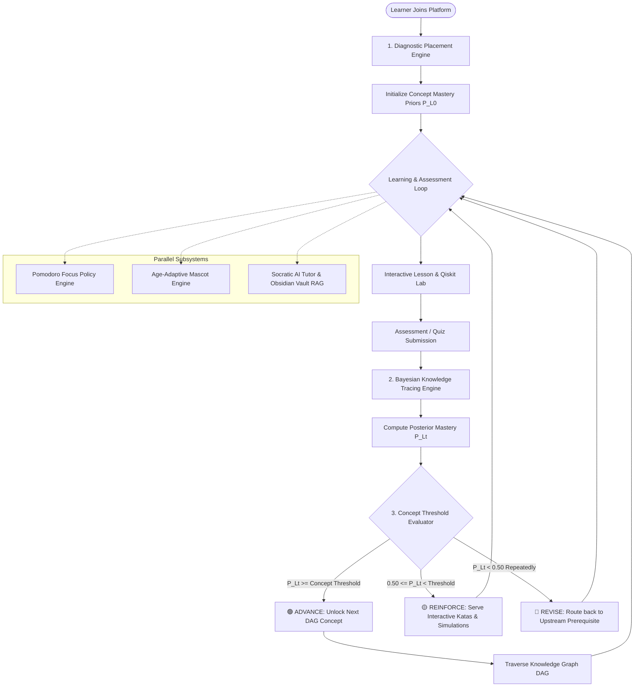
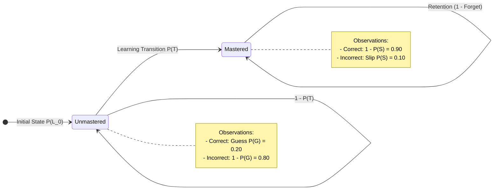
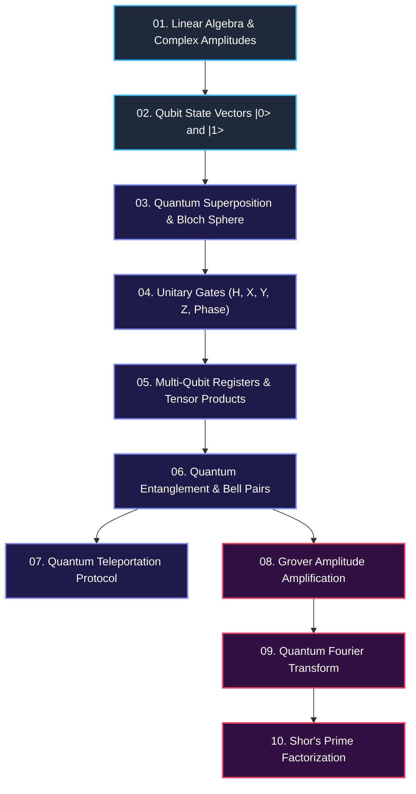
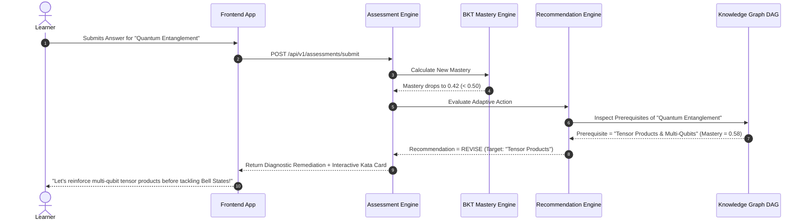
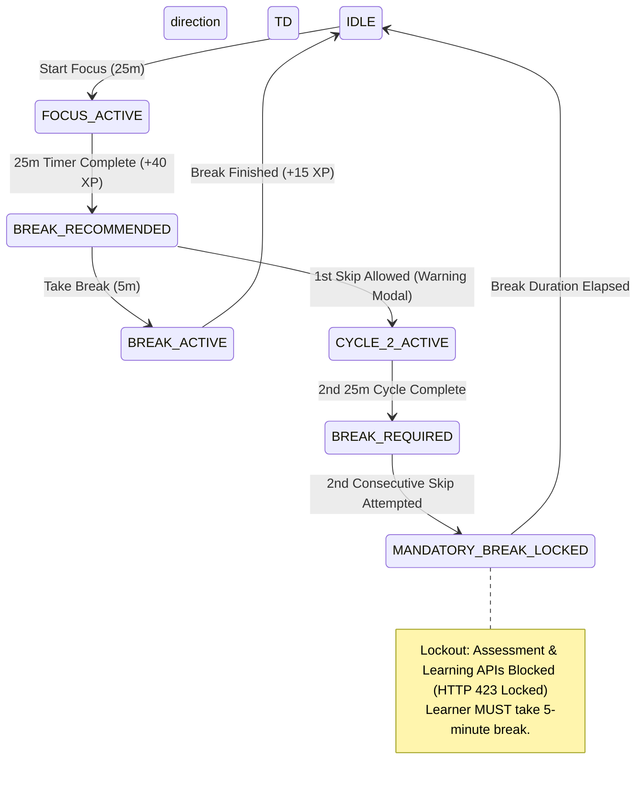
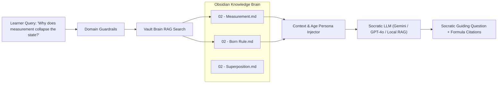

# Adaptive Learning Engine Architecture & Working Blueprint

> **A Comprehensive Visual & Mathematical Guide to the Multi-Tiered Quantum Adaptive Learning System**

---

## 1. Executive Overview & System Architecture

The Adaptive Learning Engine powers a personalized, non-linear quantum computing curriculum. Instead of forcing all learners through a rigid linear sequence, it dynamically evaluates cognitive mastery, calculates real-time transition probabilities, enforces prerequisite mastery via a Directed Acyclic Graph (DAG), and provides automated remediation.

### 1.1 Complete End-to-End Visual Pipeline



---

## 2. Component 1: Diagnostic Placement Engine

When a learner first logs in, they undergo an adaptive diagnostic assessment to evaluate their mathematical and quantum foundations.

```
       [ Diagnostic Quiz (Math & Quantum Foundations) ]
                             │
            ┌────────────────┼────────────────┐
            ▼                ▼                ▼
     Score < 50%      Score 50% - 79%     Score >= 80%
            │                │                │
            ▼                ▼                ▼
     [ BEGINNER ]    [ INTERMEDIATE ]   [ ADVANCED ]
            │                │                │
   P(L0) Math = 0.10 P(L0) Math = 0.60 P(L0) Math = 0.90
   P(L0) Qubit = 0.05P(L0) Qubit= 0.50 P(L0) Qubit= 0.85
   Starts at Stage 01Starts at Stage 03Fast-tracks to Stage 06
```

### Purpose:
* Prevents advanced learners from being bored by basic linear algebra.
* Prevents novice learners from being overwhelmed by complex multi-qubit gates.

---

## 3. Component 2: Bayesian Knowledge Tracing (BKT) Engine

The mathematical core of the adaptive assessment is **Bayesian Knowledge Tracing (BKT)**. BKT models student knowledge as a latent (hidden) binary variable: **Mastered ($L=1$)** or **Not Mastered ($L=0$)**.

### 3.1 The Hidden Markov State Machine



### 3.2 The 4 Standard Parameters

| Parameter | Symbol | Default Value | Meaning |
| :--- | :---: | :---: | :--- |
| **Prior** | $P(L_0)$ | $0.10$ | Baseline probability that learner already knows the concept before instruction. |
| **Transition** | $P(T)$ | $0.15$ | Probability that learner transitions from unmastered to mastered state after a learning event. |
| **Slip** | $P(S)$ | $0.10$ | Probability that a learner who **knows** the concept makes an accidental mistake. |
| **Guess** | $P(G)$ | $0.20$ | Probability that a learner who **does not know** the concept guesses the correct answer. |

---

### 3.3 The Real-Time Update Formulas

#### Step 1: Observation Update (Bayes' Theorem)

* **Case A: Learner answers CORRECTLY**
  $$P(L_t | \text{Correct}) = \frac{P(L_{t-1}) \cdot (1 - P(S))}{P(L_{t-1}) \cdot (1 - P(S)) + (1 - P(L_{t-1})) \cdot P(G)}$$

* **Case B: Learner answers INCORRECTLY**
  $$P(L_t | \text{Incorrect}) = \frac{P(L_{t-1}) \cdot P(S)}{P(L_{t-1}) \cdot P(S) + (1 - P(L_{t-1})) \cdot (1 - P(G))}$$

#### Step 2: Learning Transition Update (Accounting for Instruction)

$$P(L_t) = P(L_t | \text{Obs}) + \Big(1 - P(L_t | \text{Obs})\Big) \cdot P(T)$$

---

### 3.4 Step-by-Step Numerical Walkthrough

Suppose a learner starts a new concept (*Superposition*) with prior $P(L_0) = 0.20$.

```
Attempt 1 (Correct):
  P(L1 | Correct) = (0.20 * 0.90) / [ (0.20 * 0.90) + (0.80 * 0.20) ]
                  = 0.18 / [ 0.18 + 0.16 ] = 0.18 / 0.34 = 0.5294
  P(L1) after Transition = 0.5294 + (1 - 0.5294) * 0.15 = 0.6000  (60.0% Mastery)

Attempt 2 (Correct):
  P(L2 | Correct) = (0.60 * 0.90) / [ (0.60 * 0.90) + (0.40 * 0.20) ]
                  = 0.54 / [ 0.54 + 0.08 ] = 0.54 / 0.62 = 0.8710
  P(L2) after Transition = 0.8710 + (1 - 0.8710) * 0.15 = 0.8903  (89.0% Mastery)

Result: 89.0% >= 80.0% (Core Concept Threshold) -> CONCEPT MASTERED! Unlocks next lesson.
```

---

## 4. Component 3: Concept-Weighted Mastery Thresholds

Rather than treating all concepts equally, the platform enforces **domain-calibrated mastery thresholds**:

```
 1.00 ┌───────────────────────────────────────────────────────────┐
      │                                                           │
 0.85 ├──────────────────────────── [FOUNDATIONAL THRESHOLD: 85%] │
      │ (Linear Algebra, Qubit State Vectors, Bra-Ket Notation)   │
 0.80 ├──────────────────────────── [CORE THRESHOLD: 80%]         │
      │ (Superposition, Pauli Gates, Bell State Entanglement)     │
 0.70 ├──────────────────────────── [ADVANCED THRESHOLD: 70%]     │
      │ (Grover Search, Shor's Algorithm, Surface Codes)          │
 0.00 └───────────────────────────────────────────────────────────┘
```

* **Foundational (0.85)**: Strict threshold prevents cognitive debt in multi-qubit systems.
* **Core (0.80)**: Standard operational threshold for quantum circuit design.
* **Advanced (0.70)**: Exploratory threshold for cutting-edge algorithms and hardware protocols.

---

## 5. Component 4: Knowledge Graph DAG & Prerequisite Resolver

The curriculum is represented as a **Directed Acyclic Graph (DAG)** with 106 concepts and 749 prerequisite edges extracted directly from Obsidian wikilinks.

### 5.1 Knowledge Graph DAG Sample



### 5.2 Topological Sorting & Prerequisite Enforcement
Before unlocking any concept $C_k$, the engine verifies:
$$\forall P_i \in \text{Prerequisites}(C_k): \quad \text{Mastery}(P_i) \ge \text{Threshold}(P_i)$$

If even a single prerequisite is below threshold, $C_k$ remains **LOCKED**.

---

## 6. Component 5: Dynamic Remediation Flow (Backtracking in DAG)

When a student struggles with a concept, the adaptive engine does not simply repeat the same question. It performs **DAG Backtracking Remediation**:



---

## 7. Component 6: Age-Bracket Cognitive Adaptation

The platform adapts content, cognitive load, and mascot tone according to the learner's age group:

```
┌─────────────────┬───────────────────┬────────────────────────────────────────┐
│ Persona         │ Cognitive Load    │ Visual & Pedagogical Style              │
├─────────────────┼───────────────────┼────────────────────────────────────────┤
│ 🐣 YOUNG        │ Low / Intuitive   │ • Spatial & coin-flip analogies        │
│   (Ages 8-12)   │                   │ • High gamification (Mascot animations)│
│                 │                   │ • Simplified non-matrix math           │
├─────────────────┼───────────────────┼────────────────────────────────────────┤
│ 🎓 STUDENT      │ Medium / Standard │ • Dirac Bra-Ket notation               │
│   (Ages 13-22)  │                   │ • Interactive Qiskit Python circuits   │
│                 │                   │ • Standard STEM curriculum alignment   │
├─────────────────┼───────────────────┼────────────────────────────────────────┤
│ 💼 ADULT        │ High / Rigorous   │ • Full unitary proof derivations       │
│   (Ages 23+)    │                   │ • Density matrices & Lindblad dynamics │
│                 │                   │ • Industrial Qiskit SDK workflows      │
└─────────────────┴───────────────────┴────────────────────────────────────────┘
```

---

## 8. Component 7: Pomodoro Focus Break Policy State Machine

To prevent cognitive fatigue during complex quantum calculations, the backend enforces an authoritative **Focus Policy**:



---

## 9. Component 8: Socratic AI Tutor & Obsidian Vault RAG

The AI Tutor uses **In-Context Socratic Prompting** combined with **Retrieval-Augmented Generation (RAG)** over the 107 Obsidian markdown notes:



---

## 10. Summary Matrix of Adaptive Engines

| Subsystem | Underlying Algorithm | Response Time | Zero-Trust Authority |
| :--- | :--- | :---: | :---: |
| **Knowledge Tracing** | Bayesian Knowledge Tracing (BKT) | $< 2\text{ ms}$ | ✅ Backend Calculated |
| **Path Navigation** | Topological Sort on 749-Edge DAG | $< 5\text{ ms}$ | ✅ Backend Validated |
| **Focus Policy** | Finite State Machine (FSM) with Lockout | $< 1\text{ ms}$ | ✅ Server Enforced |
| **Gamification** | Immutable Double-Entry XP Ledger | $< 3\text{ ms}$ | ✅ Server Enforced |
| **Simulation Lab** | Qiskit Aer Statevector & Shots Simulator | $50 - 200\text{ ms}$ | ✅ Sandbox Executed |
| **AI Tutor** | Obsidian Vault RAG + Socratic Prompting | $300 - 800\text{ ms}$ | ✅ Guardrailed |
